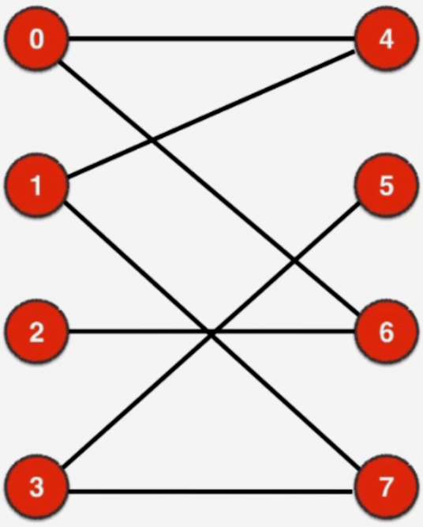

# 匈牙利算法

## 基本原理

1.不借助有向图，也不借助最大流模型，效率更高。用最大流模型来解决匹配问题时，构造的图也是一个特殊的网络流，每条边的容量只为1，因为有这样一个特殊性质，我们本质只是选边而已
。匈牙利算法就是看能不能就在二分图上进行选边。

2.匈牙利算法是在二分图的一边还没有匹配的点出发来寻找看能不能在图中添加新的匹配，关键是怎么寻找看这个图中有新的匹配。这个寻找过程是这样的

首先从0点出发，0点是没有匹配的点，那么可以从0点到右边的任意一点，那么我们按顺序来，到4这个点，4这个点也是没匹配的点，两个没有匹配的点，他们之间相连了，那他们之间的边
肯定就是一个匹配。我们就找到了一个匹配。我们在看左边第二个没有匹配的点，我们从1出发，可以先来到4这个顶点。4这个点是右侧的已经匹配的点，我们在寻找新的匹配的过程中，其实
我们在找一条路径，我们找的这条路径，此时我们不遍历4的所有相邻顶点，我们直接走和4匹配的点，在这里我们直接走到0，0又是左边的点（颜色相同），那么对于左边的点，我们可以寻找与它相邻的任意一个点，
当然要没被遍历过。和0相邻的顶点，4已经遍历过了，6还没遍历，我们就来到6，6是一个未匹配的点，至此我们寻找的路径就结束了。我们找到的路径是1--4--0--6，这条路径特点是首尾两个点都是未匹配的点，
而相应的中间的两个点是匹配的点。对于中间两个匹配的点，由于走到匹配的点，我们是直接顺着它的匹配的边来到另外一个与它匹配的点，因此中间的之间一定存在一条匹配的边，相应的，由于首尾两个点
是非匹配的点，所以1-4,0-6，一定是非匹配的边。我们找到了这样一条路径，下面要做的就是匈牙利算法的核心，我们可以稍微改变一下，让整个图中的匹配加一，整个改变的方法是我们让4-0这条边
不在是匹配边，转而让1-4,0-6这两条边变成匹配的边。换句话说，我们对原来路径上的非匹配-匹配-非匹配的边，我们直接颠倒顺序，变成匹配-非匹配-匹配，这样的三条边，这样一来，从
原来的只有一个匹配，变成了有两个匹配，于此同时1和6两个点也变成了匹配点。

3.下面我们从2出发，再按照上面说的原则（走到右侧匹配的点，不遍历每个相邻顶点，直接走匹配边到与这个点匹配的左边的点），找一条路径看能找到怎样的路径，我们找2的相邻顶点，我们来到了
6，6是右侧已经匹配了的顶点，我们直接转到与它对应的那个匹配点，也就是来到了0这个顶点，我们可以任意遍历0的没有遍历过的相邻顶点，我们来到4，4又是一个在右侧已经匹配过的顶点，
对于右侧已经匹配过的顶点，我们直接走到与它匹配的点，我们就来到了1，1是左侧的点，我们可以遍历1的所有没有遍历过的相邻的点，我们就来到了7，而此时7是一个未匹配的点，我们的寻找就
结束了，这里我们寻找的路径时2-6-0-4-1-7，对这条路径，依旧是首尾两个顶点是未匹配的顶点，中间的4个顶点，是两两配对，形成匹配边的，为什么两两配对，就是因为，一旦我们来到了右侧
的点，如果是一个匹配的点的话，我们没有搜索路径直接来到了和他匹配的左侧的点，那么6-0一定是一条匹配的边，同理4是一个右侧的顶点，那么4-1肯定也是一个匹配边，这样一来在这个路径中
有6个顶点5条边，这5条边的分布一定是未匹配-匹配-未匹配-匹配-未匹配。头尾连个边肯定是未匹配，这个好理解，因为首尾两个边都有未匹配的点，中间0-4这条边也是未匹配的边，这是因为
在我们搜索路径的过程中0和6一定是匹配了，在我们匹配问题中一个顶点与另一个顶点一旦匹配了就不可能再和其他顶点匹配了。所以0-6既然是一条匹配边，那么0-4就一定不是一条匹配边。
同理4-1是一条匹配边的话，4-0就一定不是一条匹配边，因此这条路径边的匹配与未匹配是交替出现的。一旦我们找到的路径有这样的性质，那么基于这条路径就可以让整张图的匹配数加一。
现在这条路径5条边中间的这两条边是匹配边，我们可以把这条路径上匹配的边换成未匹配的边，把未匹配的边换成匹配的边，这样一来，整个图的匹配数就加了一。

4.匈牙利算法的本质是，我们从左边非匹配的点出发，走向右边的点可以随便走，如果来到了一个已经匹配的点，从右向左走的话永远只走匹配的边。这样我们有来到了左侧，来到左侧后
到右边随便走（没遍历过），如果右边是一个匹配点的话，我们就继续只走匹配边回到左侧，这样以此类推。这样走的话一定是匹配边和非匹配边交替出现的。起始我们从非匹配的点出发，
到右边又只走匹配的边，走完这个匹配的边，我们再次从左到右，由于我们和之前我们走的点匹配上了，所以我们再次从左到右走到另外一个点的时候肯定又是一条非匹配边。如果这个点是已匹配的点
的话，又是只走匹配的边，这样的一条路我们叫交替路。

5.最后如果我们能终止于另外一个非匹配点的话，我们的寻找就已经结束了，此时这样的一个路径，与上面所介绍的交替路，唯一的区别在于最终我们终止在一个非匹配的点，相应的对于这一条
路径它的特点是整条路径一定包好奇数条边，因为对这一条路径来说头尾是两个非匹配的点，中间的匹配的点肯定是成对出现的。所以整条路径一定包含偶数割顶点，偶数个顶点之间一定连接着奇数条边。
那么对于这奇数条边，第一条边一定是非匹配边，下面一条肯定是匹配边，然后又是非匹配边，又是匹配边，因为是交替路，最后终止于非匹配边，因此在这奇数条边中非匹配边一定比匹配边大了一，我们把
匹配边和非匹配边互换，这样匹配边就比非匹配边大了一，通过这样的方式我们就能让整张图匹配边的个数加一。由于这条路径有这样的性质，这条路径叫：增广路径。有增广路径，就意味着
最大匹配树可以加一。

6.匈牙利算法就是不断的找增广路径。找到增广路径后互换匹配边和非匹配边，交替之后我们再更新匹配点。我们找到一条增广路径后不但匹配边增加，匹配点一定增加， 这个增加一定是在
原有的基础上增加，原来匹配的点一定不会变成非匹配的点（匹配边和非匹配边互换之后），但是由于这条增广路径上首尾两个顶点是非匹配点，所以现在就新的变成了匹配的点。因为有这样的
性质，所以我们可以不用不需要从新搜索左侧的已经匹配的点，我们继续搜索下一个非匹配的点。我们在搜索路径的过程中也有可能终止于一个匹配的点，那这条路径就不是增广路径。

7.我们使用BFS找增广路径，我们本质是寻找路径，寻找路径肯定可以使用DFS，当然也可以使用BFS。只是在使用DFS的过程中需要一点改进，因为当我们走到右边的点时，如果这个点是一个非匹配的点
，我们的寻找就结束了，如果是已匹配的点，我们也不用遍历每条边，我们直接走那条匹配边。因此在这一部分逻辑需要改进。我们每次寻路都是从左侧开始，我们用一个队列来只保存左侧的
顶点，这样我们就可以用BFS子在图中一轮一轮的找看有没有新的增广路径。在之前的描述中我们使用的是DFS，用BFS也可以，只是用BFS找到的路径中间的交替路不那么明显。

