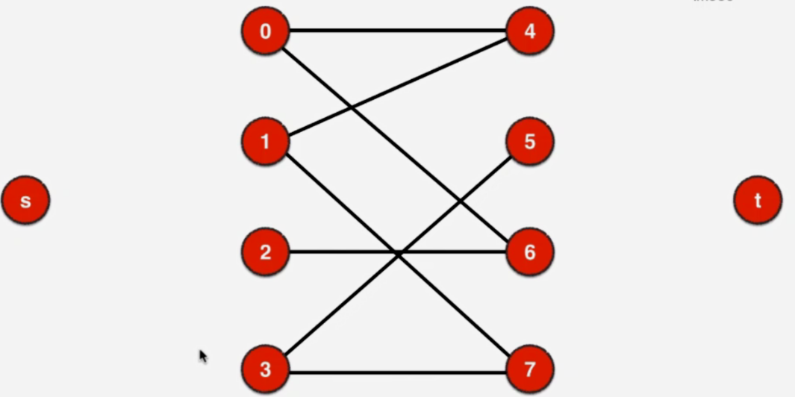
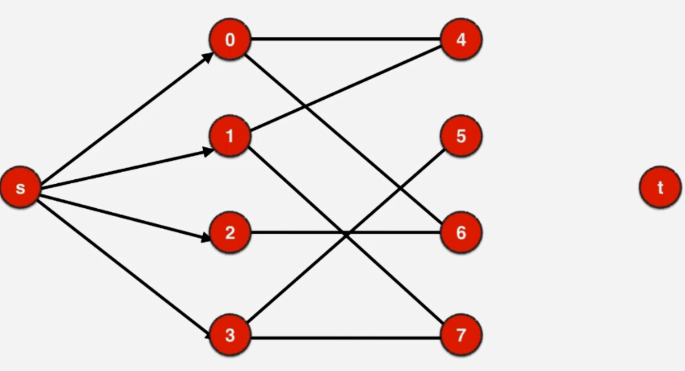
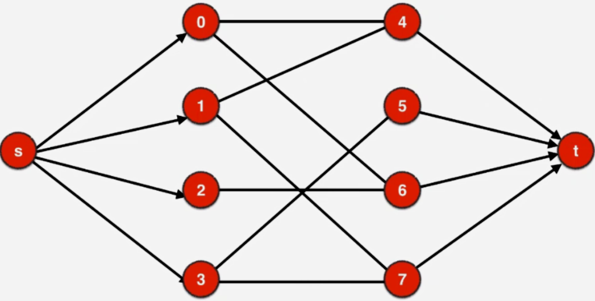

# 使用最大流算法解决匹配问题

1.最大流算法看似是基于网络流量这种物理模型进行的图论建模，但是它可以非常巧妙的解决很多看似和流量无关的问题。

2.使用最大流解决匹配问题，我们会新设立一个点把它当做源点，新设立一个点当做汇点。

之后我们从源点与整个二分图的一部分连上边，最大流是在有向图上解决问题的，所以相应的边都有箭头

整个图另外一部分到汇点再连上边。这些边也都是有向边

对于原先的无向图，我们把其中的所有的无向边改成有向边，修改的方法是，原来这个二分图，如果是被源点所指向的话，相应的这个顶点就作为，原来他所连接的这个无向图边的起始点，相应的
无向边的终止点都成为指向汇点的顶点。
