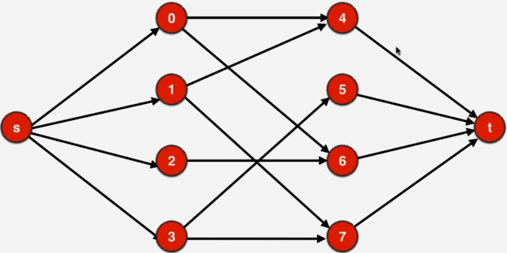

# 使用最大流算法解决匹配问题

1.最大流算法看似是基于网络流量这种物理模型进行的图论建模，但是它可以非常巧妙的解决很多看似和流量无关的问题。

2.使用最大流解决匹配问题，我们会新设立一个点把它当做源点，新设立一个点当做汇点。

之后我们从源点与整个二分图的一部分连上边，最大流是在有向图上解决问题的，所以相应的边都有箭头

整个图另外一部分到汇点再连上边。这些边也都是有向边

对于原先的无向图，我们把其中的所有的无向边改成有向边，修改的方法是，原来这个二分图，如果是被源点所指向的话，相应的这个顶点就作为，原来他所连接的这个无向图边的起始点，相应的
无向边的终止点都成为指向汇点的顶点。

这样一来我们就构造出了一个有向图，对于这个有向图来说我们再给它赋予权值，所有的边权值都为1.对于这个有向带权图来说它的最大流就是原先图的最大匹配数。我们从源点出发向这个二分图
中一部分的顶点都产生了一条容量为1的边，这个容量为1的边就能容纳1的流量，这个1个流量就相当于一个匹配，这一个流量流入了一个顶点，这个顶点最多也只能流出一个流量。换句话说
这一个流量通过我们这个建模继续流向了原来二分图的另外一部分，端点，最后这1的流量在汇集到汇点，这样就完成了匹配。一个顶点的1个流量只能流向一条边，因为是受流量平衡限制的。
与源点相连的边的容量是1，所以从源点流向这个二分图中一部分顶点的流量只能是1，从这些顶点流向这个二分图中另一部分的流量也只能是1，而中这部分顶点流向汇点的流量也只能是1，这
一个个流量就是一个个匹配。网络流模型的最大流就解决了匹配问题。

3.我们用网络流解决匹配问题是把无向图问题转换成了有向图问题。

4.有些问题可以转换成匹配问题来解决 leetcode [LCP 4 覆盖](https://leetcode-cn.com/problems/broken-board-dominoes/) 就可以用最大配发算法建模，这个题看似和最大匹配没什么
关系，我们转换一下视角就可以清晰的这个问题和二分图有密切的联系，因为这大格子是棋盘格，我们想象一下这个棋盘是像国际象棋这样的黑白相间的格子，对于每个多米诺骨牌来说贪所覆盖
的两个格子不管是横着放还是竖着放，不管放在那里，一张多米诺骨牌肯定会覆盖一个白格子的同时，覆盖一个黑格子，这个性质是解决这个问题的关键，也是把这个问题转换成二分图的关键。
这种把棋盘格子染成黑白两色的方法，是解决很多棋盘问题的套路。对这道题来说求最大匹配的算法就不是难点了，麻烦的地方在于建图。由于是无向图（方向自己定），我们只要看每个格子右边和
下边的格子的情况就可以了。这样遍历也可以避免重复。